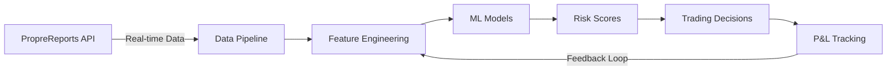

# Trading Risk Tool

<div align="center">


**Machine Learning System for Trading Risk Assessment**

*Early-stage development of behavioral risk prediction models*

</div>

---

## Project Overview

The Trading Risk Tool is an experimental system that aims to predict high-risk trading days using machine learning. Currently in active development, the system analyzes daily trading data to identify patterns that may indicate elevated risk.

### Development Status

- **Phase**: Early Development / Research
- **Models**: Initial LightGBM implementation
- **Validation**: Walk-forward backtesting framework in place
- **Features**: 10 core risk indicators implemented
- **Data Coverage**: 9 active traders (expansion planned)

## Technical Architecture

### Risk Target Definition

High-risk days are defined using multiple criteria:

1. **Large Drawdown**: Daily P&L < 5th percentile of historical distribution
2. **Excessive Fees**: Fee ratio > 50% of gross P&L
3. **Overleveraging**: Position size > 3x average
4. **Poor Execution**: Fill rate < 70% AND slippage > 2x average

### Minimal Feature Set

Starting with 10 robust, interpretable features:

- `profit_per_volume`: Net P&L per unit traded
- `execution_efficiency`: Fill rate (fills/orders)
- `leverage_ratio`: Unrealized P&L / account balance
- `sharpe_ratio`: 20-day rolling risk-adjusted return
- `sortino_ratio`: Downside risk-adjusted return
- `fee_burden`: Fees as proportion of gross P&L
- `daily_volatility`: Rolling standard deviation
- `max_drawdown`: Maximum peak-to-trough decline
- `win_rate`: Proportion of profitable days
- `risk_adjusted_return`: Return per unit of risk

## System Architecture



## Quick Start

### Prerequisites

- Python 3.9+ with Anaconda
- 16GB RAM minimum (32GB recommended)
- PropreReports API credentials

### Installation

```bash
# Clone repository
git clone https://github.com/your-org/risk-intelligence-platform.git
cd risk-intelligence-platform

# Create conda environment
conda env create -f environment.yml
conda activate risk-tool

# Configure credentials
cp .env.template .env
# Edit .env with your API_TOKEN

# Initialize system
make setup
make download  # Downloads historical data
make train     # Trains ML models
```

### Daily Operations

```bash
# Automated daily workflow (schedule via cron)
make daily  # Downloads data → Generates predictions → Creates reports

# Manual operations
make predict    # Generate risk predictions
make dashboard  # Interactive monitoring dashboard
make backtest   # Run historical validation
```

## Data Pipeline

### Input Data Specifications

- **Frequency**: Tick-level aggregated to daily
- **Coverage**: 60+ active proprietary traders
- **History**: 1000+ trading days
- **Features**: 3M+ data points daily

### Feature Engineering

Our feature pipeline implements rigorous temporal controls:

```python
@ensure_no_look_ahead_bias
@point_in_time_valid
def generate_features(data: pd.DataFrame) -> pd.DataFrame:
    """Generate 65+ behavioral and technical features"""
    return FeaturePipeline(
        technical=TechnicalFeatures(),
        behavioral=BehavioralFeatures(),
        market=MarketRegimeFeatures()
    ).transform(data)
```

## Model Development

### Current Focus

The project is currently focused on:

1. **Robust Backtesting**: Implementing walk-forward validation to prevent overfitting
2. **Target Definition**: Mathematically defining "high-risk" trading days using multiple criteria
3. **Feature Selection**: Starting with 10 interpretable features with proven predictive power
4. **Bias Mitigation**: Addressing survivorship bias in trader selection

### Validation Approach

- **Method**: Time-series aware cross-validation
- **Framework**: Custom WalkForwardValidator class
- **Goal**: Honest out-of-sample performance metrics
- **Status**: Implementation complete, validation in progress

## Monitoring & Alerts

### Real-time Monitoring
- **Drift Detection**: Kolmogorov-Smirnov test on feature distributions
- **Performance Degradation**: Sequential probability ratio test
- **Data Quality**: Automated anomaly detection

### Alert Thresholds
```yaml
critical_risk_score: >0.9     # Immediate position reduction
high_risk_score: >0.8         # Enhanced monitoring
drift_threshold: >0.15        # Model retraining trigger
accuracy_decline: <0.65       # Investigation required
```

## Advanced Usage

### Custom Feature Development

```python
from src.features.base_features import BaseFeatures

class MyCustomFeatures(BaseFeatures):
    def create_features(self, data: pd.DataFrame) -> pd.DataFrame:
        # Implement proprietary logic
        return features
```

### Model Hyperparameter Optimization

```bash
python scripts/optimize_hyperparameters.py \
    --model lightgbm \
    --trials 100 \
    --cv-folds 5 \
    --metric sharpe
```

## Important Notes

### Development Status
- This is an **experimental research project** currently under active development
- No performance claims or guarantees are made
- Extensive validation required before any production use

### Known Limitations
- Limited to 9 active traders (survivorship bias concern)
- Feature engineering still being refined
- Model validation ongoing
- No real-time trading integration yet

### Next Steps
1. Expand trader coverage to include inactive accounts
2. Complete comprehensive backtesting with WalkForwardValidator
3. Implement feature importance analysis and selection
4. Develop ensemble models for improved robustness
5. Build real-time monitoring and drift detection

## Contributing

This is a proprietary project. For questions or access requests, please contact the development team.
