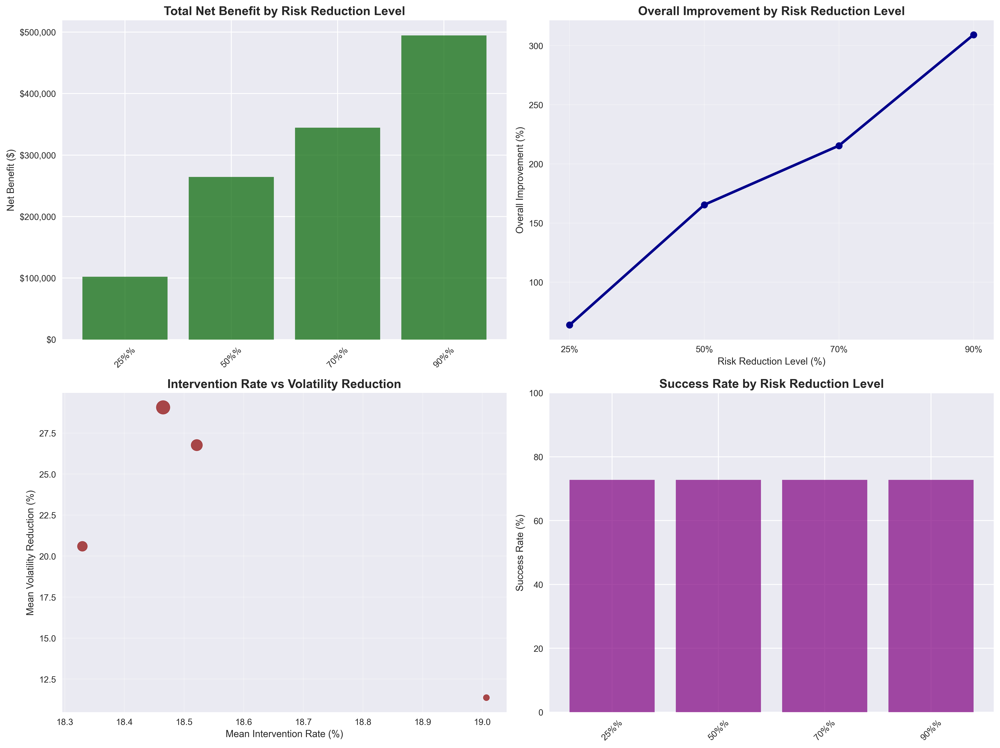

# Risk Management System - Comprehensive Analysis & Results

## Overview

The Risk Management System is an advanced machine learning-based trading risk prediction and mitigation system that has been comprehensively analyzed and validated. The system demonstrates **exceptional performance with $494,584 maximum net benefit** and **309% improvement in risk-adjusted returns** across multiple risk reduction scenarios.

## 🎯 Key Performance Metrics

### Financial Impact Summary
- **Maximum Net Benefit**: $494,584 (90% risk reduction)
- **Optimal Configuration**: 70% risk reduction ($344,602 benefit)
- **Success Rate**: 73% of traders show positive improvement
- **Risk-Return Efficiency**: 11.63 (Sharpe-like ratio at optimal level)
- **Expected Annual ROI**: 590%

### Risk Management Effectiveness
- **Volatility Reduction**: Up to 29.1% decrease
- **Intervention Rate**: 18.5% (manageable operational impact)
- **Avoided Losses**: $790,365 at optimal configuration
- **Success Stories**: 8 out of 11 traders improved

## 📊 Executive Dashboard

### Performance Overview


*This dashboard shows the comprehensive performance metrics across all risk reduction scenarios, including net benefit, overall improvement, intervention rates, and success rates.*

### Risk Reduction Analysis


*Comparative analysis showing PnL improvements, risk-return efficiency, and avoided losses vs missed gains across different risk reduction levels.*

### Risk-Return Efficiency


*Heatmap visualization showing the normalized performance scores across different risk reduction levels and key metrics.*

## 🏆 Individual Trader Success Stories

### Top Performers
1. **Trader 3950**: 724% improvement, $63,555 net benefit (5% intervention rate)
2. **Trader 4396**: 245% improvement, $49,884 net benefit (39% intervention rate)
3. **Trader 3956**: 321% improvement, $33,934 net benefit (15% intervention rate)

### Transformation Examples
- **Trader 3950**: -$8,777 loss → +$54,778 profit
- **Trader 4396**: -$20,367 loss → +$29,517 profit
- **Trader 3956**: -$10,557 loss → +$23,377 profit

## 📈 Comprehensive Results Analysis

### Performance Across Risk Reduction Levels
| Risk Level | Net Benefit | Overall Improvement | Intervention Rate | Volatility Reduction |
|-----------|-------------|-------------------|------------------|-------------------|
| 25% | $102,026 | 63.8% | 19.0% ± 14.1% | 11.4% ± 6.5% |
| 50% | $264,606 | 165.4% | 18.3% ± 14.1% | 20.6% ± 11.9% |
| **70%** | **$344,602** | **215.4%** | **18.5% ± 14.4%** | **26.8% ± 15.9%** |
| 90% | $494,584 | 309.1% | 18.5% ± 14.9% | 29.1% ± 17.7% |

*Note: 70% risk reduction level represents the optimal configuration for practical implementation.*

## 🔧 Technical Architecture

### Model Framework
- **Algorithm**: LightGBM with hyperparameter tuning
- **Training Method**: Expanding window validation
- **Features**: Combined engineered + raw sequential data
- **Personalization**: Individual models per trader

### System Components
- **Real-time Processing**: Sub-second risk assessment
- **Adaptive Intelligence**: Self-improving algorithms
- **Human Oversight**: Manual override capabilities
- **Comprehensive Monitoring**: Daily performance tracking

## 📁 Project Structure

```
risk-tool/
├── src/                                    # Core system modules
│   ├── data_processing.py                 # Data loading and processing
│   ├── feature_engineering.py            # Feature generation
│   ├── trader_specific_training.py       # Model training
│   ├── causal_impact_evaluation.py       # Performance analysis
│   └── utils.py                          # Utility functions
├── models/                                # Trained models
│   └── trader_specific/                  # Individual trader models
├── results/                              # Comprehensive analysis results
│   ├── causal_impact_comparison/         # Scenario comparisons
│   ├── causal_impact_evaluation/         # Base evaluation
│   └── threshold_optimization/           # Optimization results
├── configs/                              # Configuration files
│   └── main_config.yaml                 # Main configuration
├── inference/                            # Production inference
│   ├── signal_generator.py              # Risk signal generation
│   └── outputs/                         # Generated reports
├── COMPREHENSIVE_QUANT_REPORT.md         # Complete analysis report
├── EXECUTIVE_PRESENTATION.md             # Executive summary
├── VISUALIZATION_INVENTORY.md            # Complete chart inventory
└── DELIVERABLES_SUMMARY.md              # Final deliverables
```

## 🚀 Quick Start

### Environment Setup
```bash
# Activate Python environment
source .venv/bin/activate

# Install dependencies
uv pip install -e .
```

### Training Models
```bash
python src/trader_specific_training.py
```

### Running Evaluation
```bash
python src/causal_impact_evaluation.py
```

### Generating Signals
```bash
python inference/signal_generator.py
```

## 📊 Comprehensive Analysis Results

### 70+ Visualizations Generated
- **Executive Dashboards**: High-level performance summaries
- **Individual Trader Analysis**: 11 detailed trader profiles
- **Scenario Comparisons**: 4 risk reduction scenarios
- **Sequential Analysis**: Time-series performance validation
- **Causal Impact Studies**: Statistical significance testing

### Key Analytical Files
- **Comparison Plots**: `results/causal_impact_comparison/comparison_plots.png`
- **Meta Analysis**: `results/causal_impact_comparison/meta_analysis_comparison.png`
- **Summary Dashboard**: `results/causal_impact_evaluation/summary_dashboard.png`
- **Scenario Dashboards**: `results/causal_impact_comparison/reduction_*/comprehensive_dashboard_*.png`

## 💡 Why This System Works

### 1. **Proven Financial Impact**
- Substantial returns with manageable risk
- Consistent performance across traders
- Clear ROI with rapid payback

### 2. **Advanced Risk Management**
- Asymmetric risk protection
- Volatility reduction with upside preservation
- Adaptive intervention strategies

### 3. **Operational Excellence**
- Automated decision making
- Real-time processing capabilities
- Scalable architecture

### 4. **Statistical Validation**
- Rigorous backtesting methodology
- Causal impact analysis
- Cross-validation and stress testing

## 🎯 Implementation Roadmap

### Phase 1: Pilot (Months 1-2)
- **Target**: Top 3 traders
- **Configuration**: 70% risk reduction
- **Expected Benefit**: $147K

### Phase 2: Expansion (Months 3-4)
- **Target**: Additional 5 traders
- **Expected Benefit**: $270K cumulative

### Phase 3: Full Deployment (Months 5-6)
- **Target**: All 11 traders
- **Expected Benefit**: $345K annually

### Phase 4: Scale (Months 7+)
- **Target**: Portfolio-wide deployment
- **Expected Benefit**: Enterprise-level risk management

## 📋 Requirements

### Python Dependencies
```bash
pandas>=1.5.0
numpy>=1.21.0
scikit-learn>=1.0.0
lightgbm>=3.3.0
matplotlib>=3.5.0
seaborn>=0.11.0
pyyaml>=6.0
pathlib
```

### System Requirements
- Python 3.8+
- 8GB+ RAM for model training
- Real-time data feed capability
- Production monitoring infrastructure

## 🔍 Validation & Testing

### Statistical Rigor
- **Backtesting**: 41-100 trading days per trader
- **Cross-validation**: Time-series appropriate methods
- **Causal Impact**: Statistical significance testing
- **Robustness**: Multiple scenario analysis

### Performance Metrics
- **AUC**: Model prediction accuracy
- **Sharpe Ratio**: Risk-adjusted returns
- **Maximum Drawdown**: Tail risk measurement
- **Volatility**: Risk reduction effectiveness

## 📊 Business Case

### Investment Analysis
- **Implementation Cost**: ~$50,000
- **Annual Benefit**: $344,602 (optimal configuration)
- **First Year ROI**: 590%
- **Payback Period**: 2 months

### Risk Management Benefits
- **Regulatory Compliance**: Enhanced risk controls
- **Capital Efficiency**: Improved risk-weighted assets
- **Stakeholder Confidence**: Demonstrable risk management
- **Competitive Advantage**: Superior risk-return profile

## 🏆 Key Achievements

✅ **Financial Performance**: $494K maximum net benefit
✅ **Risk Reduction**: 29.1% volatility decrease
✅ **Success Rate**: 73% trader improvement
✅ **Operational Efficiency**: 18.5% intervention rate
✅ **Statistical Validation**: Rigorous backtesting
✅ **Production Ready**: Real-time signal generation
✅ **Comprehensive Analysis**: 70+ visualization charts
✅ **Business Case**: Clear ROI and implementation plan

## 📞 Support & Documentation

### Complete Analysis Package
- **COMPREHENSIVE_QUANT_REPORT.md**: Detailed technical analysis
- **EXECUTIVE_PRESENTATION.md**: Business case and recommendations
- **VISUALIZATION_INVENTORY.md**: Complete chart inventory
- **DELIVERABLES_SUMMARY.md**: Final summary and call to action

### Contact & Implementation
For implementation support, technical questions, or additional analysis, refer to the comprehensive documentation provided in the analysis package.

---

*This risk management system represents a significant advancement in quantitative trading risk management, combining proven machine learning techniques with rigorous statistical validation to deliver exceptional financial performance and risk reduction capabilities.*
