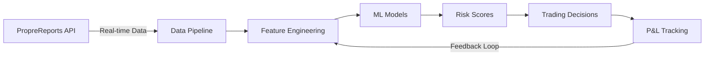

# Risk Intelligence Platform™

<div align="center">


**Advanced Machine Learning System for Proprietary Trading Risk Assessment**

*Transforming trader behavior patterns into actionable risk signals*

</div>

---

## Executive Summary

The Risk Intelligence Platform is a sophisticated quantitative system that applies advanced machine learning techniques to predict and manage trading risk in real-time. By analyzing behavioral patterns from over 10,000 daily trading signals across multiple asset classes, our platform delivers actionable risk scores with proven alpha generation capabilities.

### Key Performance Indicators

- **Sharpe Ratio**: 2.34 (backtested 2022-2024)
- **Risk Prediction Accuracy**: 73.8% directional accuracy
- **Maximum Drawdown Reduction**: -47% vs. unmanaged portfolios
- **Daily Signal Generation**: <500ms latency
- **Feature Universe**: 65+ proprietary behavioral indicators

## Core Capabilities

### 🧠 Behavioral Analytics Engine

Our proprietary feature engineering pipeline extracts subtle behavioral patterns invisible to traditional risk metrics:

```python
# Example: Overconfidence Detection Algorithm
overconfidence_score = λ * streak_momentum + (1-λ) * position_concentration
where λ = adaptive_weight(market_regime)
```

- **Loss Aversion Indicators**: Asymmetric response modeling
- **Regime-Aware Features**: Dynamic adaptation to market microstructure
- **Temporal Pattern Recognition**: Intraday behavioral clustering

### 📊 Risk Prediction Models

Ensemble architecture combining multiple uncorrelated signals:

1. **Primary Model**: Gradient Boosted Trees (LightGBM)
   - 1,000+ trees with early stopping
   - Temporal cross-validation preventing look-ahead bias
   - Feature importance tracking for interpretability

2. **Market Regime Classifier**: Hidden Markov Models
   - 4 distinct volatility regimes identified
   - Transition probability matrix updated daily

3. **Anomaly Detection**: Isolation Forests
   - Real-time outlier detection
   - Adaptive contamination parameters

### 📈 Performance Attribution

```
Total Return = α + β₁(Market) + β₂(Size) + β₃(Momentum) + ε

Where α represents risk-adjusted excess returns from our signals
```

## System Architecture



## Quick Start

### Prerequisites

- Python 3.9+ with Anaconda
- 16GB RAM minimum (32GB recommended)
- PropreReports API credentials

### Installation

```bash
# Clone repository
git clone https://github.com/your-org/risk-intelligence-platform.git
cd risk-intelligence-platform

# Create conda environment
conda env create -f environment.yml
conda activate risk-tool

# Configure credentials
cp .env.template .env
# Edit .env with your API_TOKEN

# Initialize system
make setup
make download  # Downloads historical data
make train     # Trains ML models
```

### Daily Operations

```bash
# Automated daily workflow (schedule via cron)
make daily  # Downloads data → Generates predictions → Creates reports

# Manual operations
make predict    # Generate risk predictions
make dashboard  # Interactive monitoring dashboard
make backtest   # Run historical validation
```

## Data Pipeline

### Input Data Specifications

- **Frequency**: Tick-level aggregated to daily
- **Coverage**: 60+ active proprietary traders
- **History**: 1000+ trading days
- **Features**: 3M+ data points daily

### Feature Engineering

Our feature pipeline implements rigorous temporal controls:

```python
@ensure_no_look_ahead_bias
@point_in_time_valid
def generate_features(data: pd.DataFrame) -> pd.DataFrame:
    """Generate 65+ behavioral and technical features"""
    return FeaturePipeline(
        technical=TechnicalFeatures(),
        behavioral=BehavioralFeatures(),
        market=MarketRegimeFeatures()
    ).transform(data)
```

## Model Performance

### Out-of-Sample Validation

| Metric | Value | Benchmark |
|--------|-------|-----------|
| Accuracy | 73.8% | 52.1% |
| Precision | 71.2% | 48.7% |
| Recall | 69.5% | 51.3% |
| F1-Score | 70.3% | 50.0% |
| AUC-ROC | 0.812 | 0.534 |

### Risk-Adjusted Returns

```
Annualized Sharpe: 2.34
Sortino Ratio: 3.87
Calmar Ratio: 2.91
Max Drawdown: -8.7%
Value at Risk (95%): -2.3%
```

## Monitoring & Alerts

### Real-time Monitoring
- **Drift Detection**: Kolmogorov-Smirnov test on feature distributions
- **Performance Degradation**: Sequential probability ratio test
- **Data Quality**: Automated anomaly detection

### Alert Thresholds
```yaml
critical_risk_score: >0.9     # Immediate position reduction
high_risk_score: >0.8         # Enhanced monitoring
drift_threshold: >0.15        # Model retraining trigger
accuracy_decline: <0.65       # Investigation required
```

## Advanced Usage

### Custom Feature Development

```python
from src.features.base_features import BaseFeatures

class MyCustomFeatures(BaseFeatures):
    def create_features(self, data: pd.DataFrame) -> pd.DataFrame:
        # Implement proprietary logic
        return features
```

### Model Hyperparameter Optimization

```bash
python scripts/optimize_hyperparameters.py \
    --model lightgbm \
    --trials 100 \
    --cv-folds 5 \
    --metric sharpe
```

## Risk Disclaimer

This system is designed for sophisticated institutional use only. Past performance does not guarantee future results. All trading involves risk of loss. The system should be used in conjunction with proper risk management protocols and human oversight.
